\newpage

# Sistemas Operativos

## Objetivos del Sistema Operativo

Desde el punto de vista del usuario, el sistema operativo consiste en una serie de programas y funciones que ocultan los detalles del hardware,ofreciéndole una vía sencilla y flexible de acceso al mismo, teniendo dos objetivos fundamentales:

### Seguridad

El sistema operativo debe actuar contra cualquier manipulación extraña, ya sea accidental o premeditada que pudiera dañar la información, perjudicar a otros usuarios o provocar un funcionamiento indeseado del sistema. Por ejemplo, hay ciertas instrucciones que pueden parar la máquina y otras que realizan operaciones directamente sobre el hardware, que debemos evitar que se utilicen por los programas. Para ello, algunos sistemas proporcionan dos estados, llamados estado protegido (Sistema o `Kernel`), en el cual se ejecuta el sistema operativo, y estado no protegido (Usuario o User), que es el destinado a la ejecución de los programas de usuario y de aplicación. De esta manera se impide que los programas de los usuarios puedan tener contacto directo con el hardware, o puedan forzar un incorrecto funcionamiento del sistema.

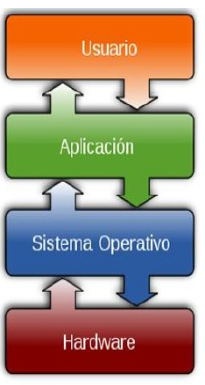
\

### Abstracción

La tendencia actual del software y de los lenguajes de programación es ocultar lo más posible los detalles de más bajo nivel, intentando dar a los niveles superiores una visión más sencilla, global y abstracta, ofreciéndoles operaciones para manipular dichas estructuras ocultas, desconociendo por completo la gestión interna de las mismas. Sobre estas estructuras se construyen otras que abstraen a las anteriores, y así sucesivamente. Gracias a la abstracción, los sistemas operativos enmascaran los recursos físicos, permitiendo su manejo con funciones más generales que ocultan las básicas, constituyendo verdaderos recursos ficticios o virtuales, que mejoran y son más potentes que los físicos. Desde el punto de vista de un programa o usuario, la máquina física se convierte, en una máquina extendida, que presenta la ventaja respecto a la física de ofrecer más funciones de las que normalmente soportaría esta última. Entre las posibilidades de esto estarían las carpetas compartidas, los usuarios de red, las impresoras compartidas, etc.

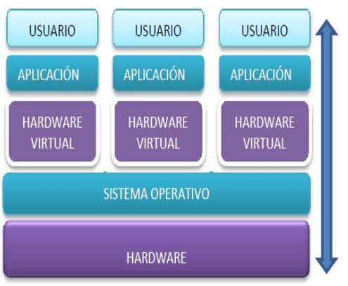
\

Desde el punto de vista del usuario, el sistema operativo proporciona servicios que no están presentes en la máquina subyacente. Estos servicios incluyen las facilidades de carga y ejecución de programas, interacción entre el usuario y los programas, permitiendo que se ejecuten varios al mismo tiempo, gestión de los servicios y almacenamiento de datos y programas.

Como resumen, podemos decir que el sistema operativo persigue alcanzar la mayor eficiencia posible del hardware y facilitar el uso del mismo a los usuarios y a las aplicaciones

\newpage

## Funciones de los Sistemas Operativos

Las funciones de los sistemas operativos son diversas y han ido evolucionando de acuerdo con los progresos que la técnica y la informática han experimentado. Como principales funciones, podríamos enumerar las siguientes:

### Gestión de procesos

Hay que diferenciar entre los conceptos programa y proceso. Un programa es un ente pasivo, que cuando se carga en memoria y comienza a ejecutarse, origina uno o varios procesos.

### Gestión de la memoria

La gestión de memoria, suele ir asociada a la gestión de procesos. Para ejecutar un proceso es necesario asignarle unas direcciones de memoria exclusivas para él y cargarlo en ellas, cuando el proceso finalice su ejecución es necesario liberar las direcciones de memoria que estaba usando.

### Gestión de ficheros

Un fichero es una abstracción para definir una colección de información no volátil. Su objetivo es proporcionar un modelo de trabajo sencillo con la información almacenada en los dispositivos de almacenamiento. Estos ficheros deben tener espacio asignado en los dispositivos, deben estar protegidos entre ellos, deben organizarse según unos determinados esquemas... todo esto es la gestión de ficheros.

### Gestión de los dispositivos de E/S

La gestión de la entrada salida (E/S) tiene como objetivo proporcionar una interfaz de alto nivel de los dispositivos de E/S sencilla de
utilizar.

### Gestión de la red

El sistema operativo es el encargado de gestionar los distintos niveles de red, los drivers (controladores) de los dispositivos involucrados en la red, los protocolos de comunicación, las aplicaciones de red, etc.

### Protección y seguridad

Mecanismos para permitir o denegar el acceso a los usuarios y a sus procesos a determinados recursos (ficheros, dispositivos de E/S, red, etc.).

\newpage

## Tipos de Sistemas Operativos

Existen muchas categorizaciones, pero una de las más comunes es la de los servicios que ofrece.

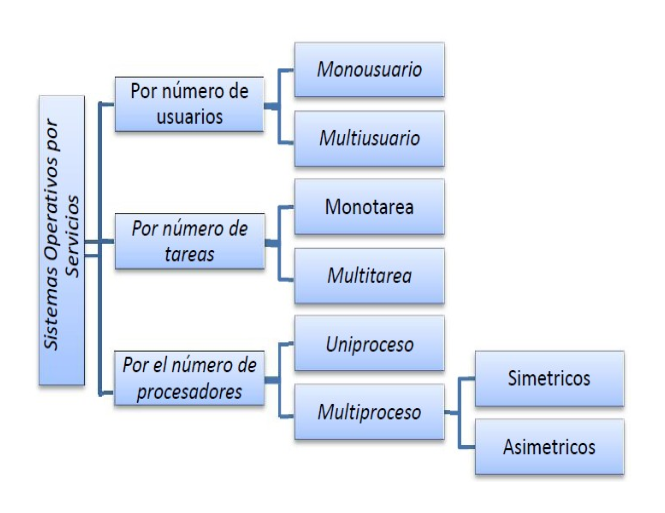
\

### Según el número de usuarios

#### Monousuarios

Los sistemas operativos monousuarios son aquéllos que soportan a un usuario a la vez, sin importar el número de procesadores que tenga la computadora o el número de procesos o tareas que el usuario pueda ejecutar en un mismo instante de tiempo.

Sistemas Operativos Monousuario:

* MS-DOS
* Windows 95
* Windows 98

#### Multiusuario

Los sistemas operativos multiusuario son capaces de dar servicio a más de un usuario a la vez, ya sea por medio de varias terminales conectadas a la computadora o por medio de sesiones remotas en una red de comunicaciones. No importa el número de procesadores en la máquina ni el número de procesos que cada usuario puede ejecutar simultáneamente.

Sistemas Operativos Multiusuario:

* UNIX-GNU/LinuX
* Windows NT (en adelante)

### Según el número de tareas

#### Monotarea

Los sistemas monotarea son aquellos que sólo permiten una tarea a la vez por usuario. Puede darse el caso de un sistema multiusuario y monotarea, en el cual se admiten varios usuarios al mismo tiempo pero cada uno de ellos puede estar haciendo solo una tarea a la vez.

#### Multitarea

Un sistema operativo multitarea es aquél que le permite al usuario estar realizando varias labores al mismo tiempo. Por ejemplo, puede estar editando el código fuente de un programa durante su depuración mientras compila otro programa, a la vez que está recibiendo correo electrónico en un proceso en background (segundo plano). Es común encontrar en ellos interfaces gráficas orientadas al uso de menús y el ratón, lo cual permite un rápido intercambio entre las tareas para el usuario, mejorando su productividad.

\newpage

### Sistemas Operativos Distribuidos

Un sistema distribuido se define como una colección de equipos informáticos separados físicamente y conectados entre sí por una red de comunicaciones distribuida; cada máquina posee sus componentes de hardware y software de modo que el usuario percibe que existe un solo sistema (no necesita saber qué cosas están en qué máquinas). El usuario accede a los recursos remotos de la misma manera en que accede a recursos locales ya que no percibe que existan varios ordenadores, sino que solo es capaz de ver uno formado por todos los anteriores.
Una ventaja fundamental de los sistemas distribuidos, es que permiten aumentar la potencia del sistema informático, de modo que 100 ordenadores trabajando en conjunto, permiten formar un único ordenador que sería 100 veces más potente que un ordenador convencional.

Los sistemas distribuidos son muy confiables, ya que si un componente del sistema se estropea otro componente debe de ser capaz de reemplazarlo, esto se denomina **Tolerancia a Fallos**.

El tamaño de un sistema distribuido puede ser muy variado, ya sean decenas de hosts (red de área local), centenas de hosts (red de área metropolitana), y miles o millones de hosts (Internet); esto se denomina escalabilidad. De hecho, si un ordenador formando por
un sistema distribuido se queda “corto” para las necesidades de la empresa, basta con instalar más.

La computación distribuida ha sido diseñada para resolver problemas demasiado grandes para cualquier supercomputadora y mainframe, mientras se mantiene la flexibilidad de trabajar en múltiples problemas más pequeños.

Esta forma de computación se conoce como **grid**. Los grandes retos de cálculo de hoy en día, como el descubrimiento de medicamentos,
simulación de terremotos, inundaciones y otras catástrofes naturales, modelización del clima/tiempo, grandes buscadores de internet, el programa [Seti@Home](http://setiweb.ssl.berkeley.edu/), etc. Son posibles gracias a estos sistemas operativos distribuidos que permiten utilizar la computación distribuida.

El modelo de computación de ciclos redundantes, también conocido como *computación zombi*, es el empleado por aplicaciones como *Seti@Home*, consistente en que un servidor o grupo de servidores distribuyen trabajo de procesamiento a un grupo de computadoras voluntarias a ceder capacidad de procesamiento no utilizada. Básicamente, cuando dejamos nuestro ordenador encendido, pero sin utilizarlo, la capacidad de procesamiento se desperdicia por lo general en algún protector de pantalla, este tipo de procesamiento distribuido utiliza nuestra computadora cuando nosotros no la necesitamos, aprovechando al máximo la capacidad de procesamiento. La consola PS3 también cuenta con una iniciativa de este tipo.

Otro método similar para crear sistemas de supercomputadoras es el clustering

Un **cluster** o racimo de computadoras consiste en un grupo de computadoras de relativo bajo costo conectadas entre
sí mediante un sistema de red de alta velocidad (gigabit de fibra óptica por lo general) y un software que realiza la distribución de la carga de trabajo entre los equipos. Por lo general, este tipo de sistemas cuentan con un centro de almacenamiento de datos único. Los clusters tienen la ventaja de ser sistemas redundantes, si falla un equipo se resiente un poco la potencia del cluster, pero los demás equipos hacen que no se note el fallo.

Algunos sistemas operativos que permiten realizar **clustering** o **grid**, son:

* Amoeba
* BProc
* DragonFly BSD
* Génesis
* Kerrighed
* Mosix/OpenMosix
* Nomad
* OpenSSI
* Plurid

Un cluster que usamos habitualmente, es el que forma **Google**. Se estima que en 2010 usaba unos 450.000 ordenadores, distribuidos en varias sedes por todo el mundo y formando clusters en cada una de dichas sedes.

Cada cluster de Google está formado por miles de ordenadores y en los momentos en que se detecta que el sistema está llegando al límite de su capacidad, se instalan cientos de ordenadores más en pocos minutos, aumentado así la potencia de cada cluster. Estos equipos normalmente con ordenadores x86 como los que solemos usar nosotros, tienen instalada versiones especiales de Linux, modificadas por Google para que permitan la formación de estos clusters.

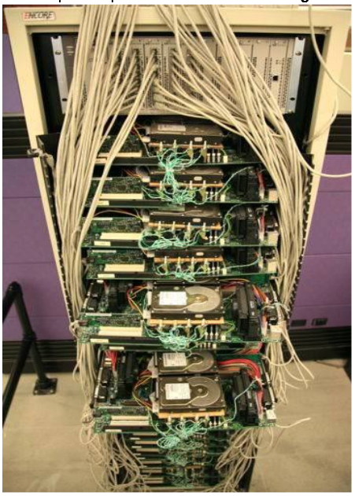
\

En la imagen anterior podemos ver el primer servidor funcional que uso **Google**. Como vemos, se basa en varios ordenadores instalados conjuntamente, a los que se les retiró simplemente la caja externa para dejar solo su contenido, a fin de aprovechar espacio en los armarios de comunicaciones.

## Versiones en Windows

Una vez tenemos claro que tipo de sistema operativo queremos instalar, y con qué propósito, es necesario hacer un pequeño estudio de que versión del mismo es la que más se adecua a nuestras necesidades.

### Server

En los sistemas Windows, si optamos por la familia de sistemas operativos para servidores, contamos con una serie de versiones que nos ofrecen determinadas opciones y características.

Aquí podéis ver una tabla resumen con las diferencias entre las versiones.

[Comparativa Windows Server](https://www.microsoft.com/es-mx/cloud-platform/windows-server-comparison)

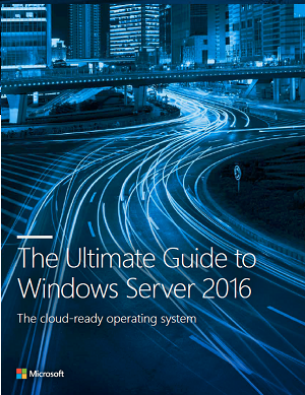
\ 

### Windows <= 10

Los sistemas Windows para escritorio han pasado por un montón de versiones, desde Windows 3.11 a Windows 10. Estas versiones han ido apareciendo en el tiempo y su soporte por parte de Microsoft ha ido _caducando_.

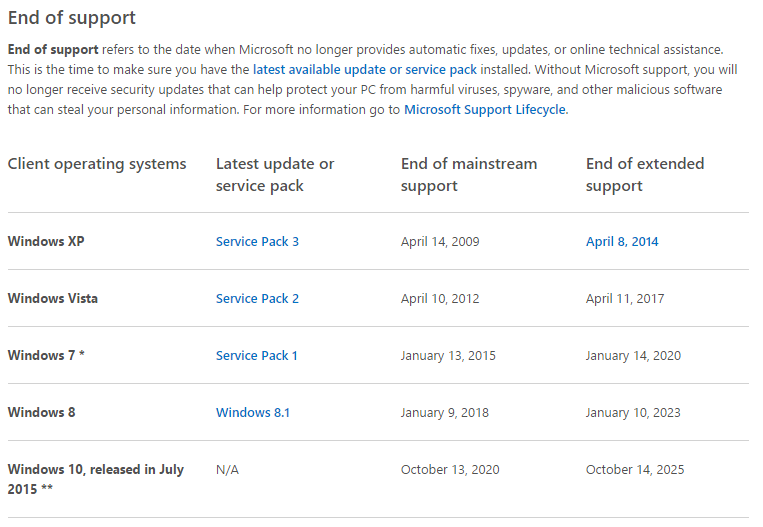
\ 

### Actualizaciones de Windows 10

Windows 10 incluye actualizaciones de manera constante, ya veremos más adelante en el módulo porqué se realizan estos cambios, es importante que por ahora tengamos en cuenta que es conveniente mantener nuestros sistemas actualizados y que es una buena práctica revisar las páginas oficiales de seguridad de los sistemas operativos que tenemos instalados en los equipos de los que somos responsables.

[Actualizaciones de Windows 10](https://support.microsoft.com/es-es/help/4464619/windows-10-update-history)

Windows 10 ha cambiado respecto a los sistemas anteriores de Windows, permitiendo siempre la actualización a la última versión disponible (actualmente estamos en la 1809). De esta manera ofrece características de seguridad y no deben preocuparse de mantener software que no se actualiza. Esto lo veremos más adelante en profundidad.

\ 

## Distribuciones de GNU/LinuX

Los sistemas GNU/LinuX son muy variados, ya que multitud de comunidades han realizado sus propias adaptaciones y selección de aplicaciones que desean llevar _por defecto_. Existen multitud de empresas que utilizan GNU/LinuX, desde Red Hat (IBM), Canonical (Ubuntu), Microsoft, y otras que aunque lo utilizan no ponen su marca en ella, uno de los ejemplos es Android y Google.

El núcleo (LinuX) + Herramientas (GNU) es lo que da lugar al sistema básico sobre el que las distribuciones y empresas trabajan.

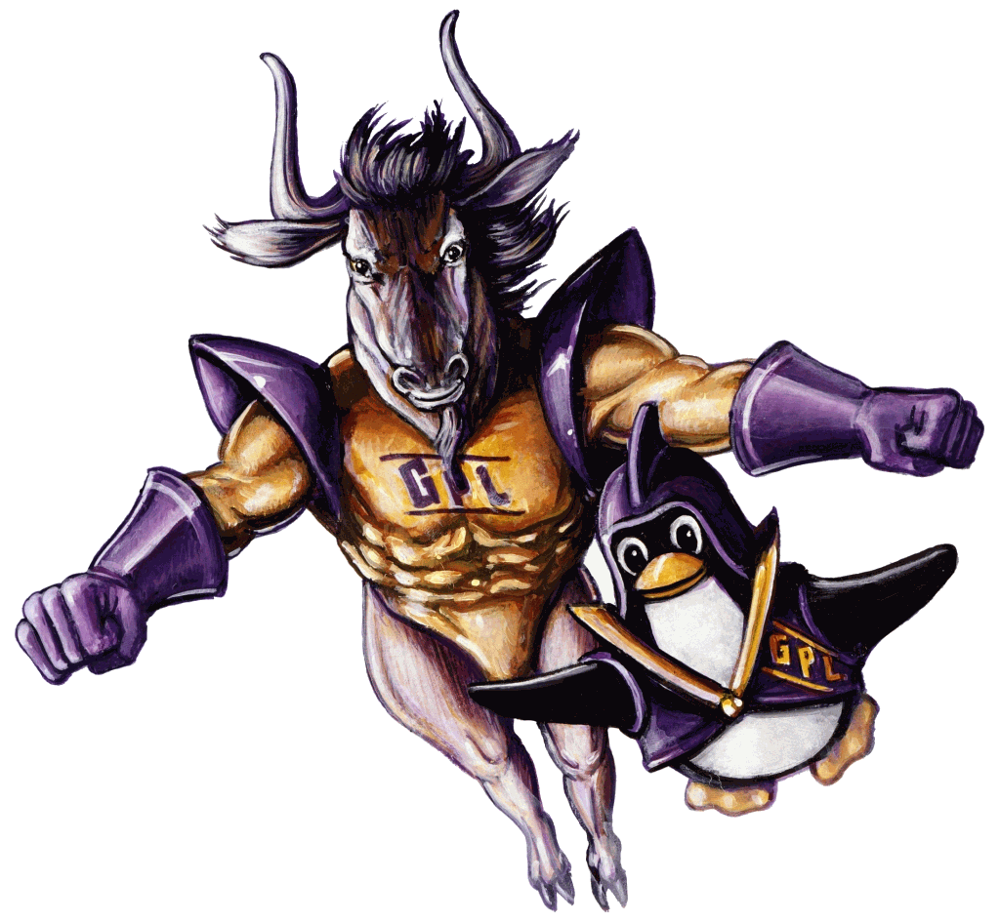
\ 

### Un poco de historia

En la década de 1970 `UNIX` era un sistema operativo no libre o privativo muy popular entre los reducidos usuarios académicos e industriales de la época. 

Su éxito es atribuido a :

* la portabilidad
* arquitectura simple
* estable
* prácticas liberales de distribución de software 
* regulaciones anti-monopolio, que obligaron durante un tiempo a su propietario (AT&T) a ofrecer el código gratuitamente a diversas instituciones.

### Richard Stallman

Mientras tanto Stallman venía de una tradición de programadores completamente distinta en los laboratorios del MIT.

\ 

Hacia principios de la década de 1980 la comunidad _hacker_ del MIT se desmoronaba junto con sus sistemas.

Habiéndose acostrumbrado a modificar y compartir tales programas en extinción; Stallman asegura que el desarrollo de un sistema operativo libre moderno y portátil (y con éste el lanzamiento del movimiento del software libre) fue una reacción contra lo que de otra manera le parecía un futuro desagradable rodeado de software privativo.

Así el sistema GNU fue diseñado para ser totalmente compatible con UNIX; aprovechando tanto el diseño modular y portable como sus usuarios.

### Linus Torvalds

Armado con las herramientas de GNU, en 1991 Linus Torvalds empezó a escribir el núcleo Linux inspirado en el libro de Minix de Andrew Tanenbaum (otro de los grandes).

\ 

En sus primeros anuncios públicos Torvalds le atribuía su acción a la frustración de no poder usar Minix comercialmente, y a la ausencia de núcleos libres tipo Unix como GNU Hurd​ o el de BSD. A pesar de sus desacuerdos suscitados a raíz de la publicación de Linux, tanto Torvalds como Tanenbaum pronosticaban que el superior núcleo de GNU eventualmente dejaría obsoletos a Linux y Minix.

En 1992 Torvalds decidió cambiar la licencia no comercial de Linux a la GPL. Rápidamente, múltiples programadores se unieron en el desarrollo, colaborando a través de Internet y consiguiendo que paulatinamente Linux fuera más serio, potente y compatible con UNIX. 

Linux fue combinado con el resto del sistema GNU, resultando en un sistema operativo libre y completamente funcional que sigue usándose al día de hoy y en completa expansión.

La combinación es conocida como "GNU/Linux" o como una "distribución Linux" y existen diversas variantes.

A lo largo del módulo, veremos muchas veces `GNU/LinuX` y `LinuX` solo, pido disculpas a los puristas que puedan leer esta documentación. La nomenclatura `correcta` es **GNU/LinuX**.

### Distribuciones y familias

Cuando una distribución se basa en una anterior, lo que normalmente `adopta` es la manera de empaquetar y distribuir las aplicaciones que hace disponibles para los usuarios.

Por ejemplo, las basadas en Debian, siguen utilizando `.deb` como paquetes de instalación, así como repositorios que disponen de esos debs de una determinada estructura.

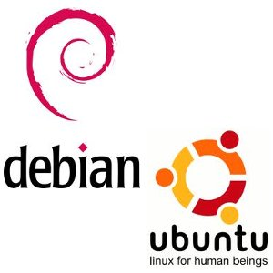
\ 

El mundo de las distribuciones es muy complejo, y toca estar al dia de los movimientos de las comunidades y empresas que soportan estas distribuciones.

Aqui adjunto un enlace a las distribuciones de GNU/LinuX más famosas:

[Distribuciones](https://upload.wikimedia.org/wikipedia/commons/1/1b/Linux_Distribution_Timeline.svg)

### Distribuciones Famosas

#### Debian

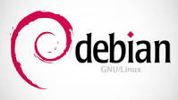
\ 

[Debian](https://www.debian.org/intro/about#what)

#### Ubuntu 

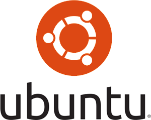
\

[Ubuntu](https://www.ubuntu.com/)

#### Fedora

\

[Fedora](https://getfedora.org/es/)

#### RedHat

\ 

[Red Hat](https://www.redhat.com/es)

#### OpenSuse

\ 

[OpenSuse](https://www.opensuse.org/)

#### Archlinux

\ 

[ArchLinux](https://www.archlinux.org/)

#### Alpine

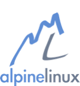
\

[Alpine](https://alpinelinux.org/)
