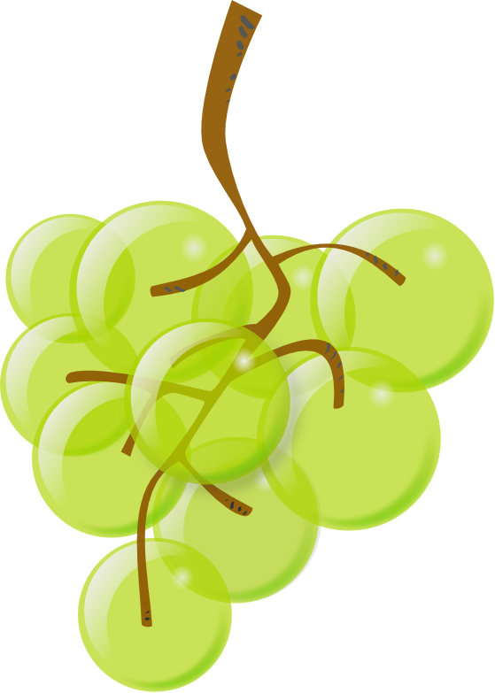

# Task 01

The perfect bunches of grapes, the beautiful ones, the black ones, are those that have *one* grape at the bottom, and then, as they go up, the number of grapes of the next level increases, at most, by one grape at a time: 1 grape at the end, 2 at the next level, 3 at next, and so on. Is said that the best sommeliers are able to identify, not only the tannins, wood aromas or bulk of a good wine, but also whether or not the bunches used were perfect. I don't think so.

However, just in case, the winemakers and farmers do take into consideration the shape of the bunches. They prefer those that, in addition to being *perfect*, have the fewest possible levels for the amount of grapes they contain. In this way, more compact bunches are obtained, which are easier to store before being pressed.

{ width=25% }\

## Input

The program should use arguments instead using standard input. 

The program must check if the number is  ~1 <= n <= 1,000,000~ indicating the number of grapes in a bunch.

## Output

For each test case the program will write the fewest possible levels and if the *bunch of grapes is perfect* that should have a perfect bunch with n grapes, so that both sommeliers and winemakers are happy with it.

## Examples of execution:

```shell
./grapes.sh 6
3 PERFECT

./grapes.sh 9
4 

./grapes.sh 10
4 PERFECT

./grapes.sh 40
9
```

