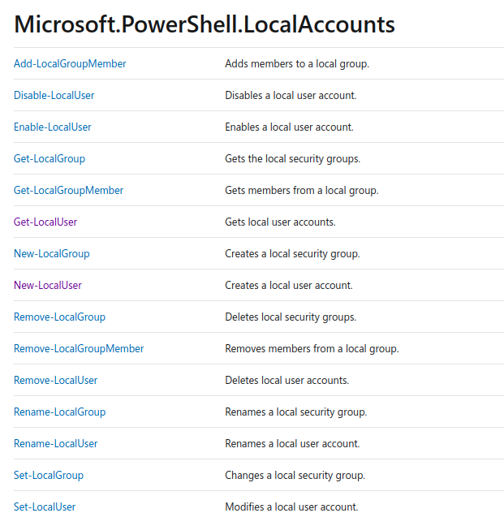

# Task 01 : Nice Tutorial!

Follow the steps from the video that explains how to code a PowerShell script to get the User Informatio and make and screenshot that show the Script and the Execution.

# Task 02 : Listing users

Make a script that show only the names of all the LocalUsers of the Machine.

# Task 03 : Testing users

Using the script of the task 02, add a test that if the user is *disabled* write a message of : "`DISABLED USERS` at the Terminal.

# Task 04 : Choose and Film!

Choose a command (or commands) from the next picture and make a video (in English), that explain the usage, the parameters, and why is useful.

\

The video length must be at least 2 minutes (without the intro and the out).