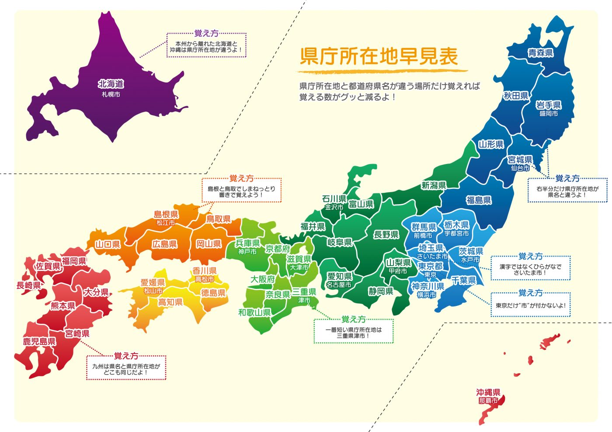

# Scripts about Users and Groups

A collection of Shell Scripts about users and groups in GNU/LinuX.

# Just a Warm-up

## Script 01

Code a Shell Script that ask for a username via Standard Input (`read`) and show all the System Users that matching in their usernames with the username given.

## Script 02

Code a Shell Script that ask for a username via Standard Input (`read`) and show all the System Users that matching in their usernames with the username given in Uppercase or lowercase.

## Script 03

Code a Shell Script that ask for a username via Standard Input (`read`) and show all the System Users that starts in their usernames with the username given.

## Script 04

Code a Shell Script that ask for a username via Standard Input (`read`) and show all the System Users that starts in their usernames with the username given in Uppercase or lowercase.

## Script 05

Code a Shell Script that ask for several characters via Standard Input (`read`) and show all the System Users that *not contains* in their usernames these characters.

## Script 06

Code a Shell Script that let the user chosing between the next paths:

- `/root/`
- `/home/`
- `/var/`

And after that, shows all the users on the systems which their $HOME are in the selected path.

## Script 07 

Code a Shell Script that uses the first argument given in order show all the users on the System which their `$HOME` matches the argument.

## Script 08 

Code a Shell Script that list from all groups on the systems each user that belongs to that group. Each group with their members.

# The continuum improving

## Script 09 

Code a Shell Script that uses the first argument to indicat if the script must list *users* or *groups*. If the first parameter is :
`user`, then the script must take the **second** argument as the *username* and list all the groups of the user given. If the first parameter is : `group`, then the script will use the **second** argument as a *groupname* and list all the users on this group.

Examples of execution:
```shell
usuario@maquina:~$./script-09.sh user tic
 * The groups of the user tic will be displayed:
tic adm sudo
```

```shell
usuario@maquina:~$./script-09.sh group sudo
 * The user of the group sudo will be displayed:
tic
aberlanas
```

## Script 10

Using the script of the task 09 as a base for development make the next improvements (next exercises uses the same base):

- Test that the number of arguments is three or show an error message and exit with error : `exit 1`

## Script 11

Improve the script 10 :

- Test if the user or the group are valid (exists on the system) before execute the commands.
  
## Script 12 

Improve the script 11 :

- Show each group or user from the listed items in separate lines.

```shell
usuario@maquina:~$./script-09.sh user tic
 * The groups of the user tic will be displayed:
tic 
adm 
sudo
```

## Script 13

Improve the script 12:

If the user is member of the group `sudo`, display a message in the same line indicating the `Super-Cow Powers`

```shell
usuario@maquina:~$./script-09.sh user tic
 * The groups of the user tic will be displayed:
tic 
adm 
sudo -> IS A SUPER USER! 
```

## Script 14

Improve the script 13:

Test if the username or groupname given as an argument *not* contains numbers or special characters before attempting to 
manage it.

\newpage 

# Loops and Loops

## Script 15

Code a Shell Script that using the `seq` command displays the numbers between the 100 and 144 using steps of 3. Waiting `0,5` seconds between each number.

## Script 16

Code a Shell Script that displays all the numbers between 80 and 160 that are multiples of 12.

## Script 17

Code a Shell Script that displays all the numbers between 100 and 300 that are multiples of 13 and 3.

## Script 18

Code a Shell Script that displays all the numbers until 1000 that are prime numbers.

## Script 19

Code a Shell Script that displays all the possibles IP in Version 4 in the World.

## Script 20

Code a Shell Script that displays all **prime factors** of a number given as first parameter (argument).

Disclaimer: *prime factors* = Factores Primos (sí, han vuelto en forma de Chapa).

## Script 21

Improve the Script 20 in order to also test that the first argument given is a number (integer).

## Script 22

Improve the Script 21 in order to also test that only *one* argument is given.

## Script 23

Code a Shell Script that calculate the sum of all prime numbers between 1 and 100.

## Script 24

Code a Shell Script that calculate the product of all prime numbers between 1 and 100.

## Script 25

Code a Shell Script that using a number given as a parameter displays the first multiple of it that is also a multiple of 5.

\newpage
# Testing arguments

## Script 26 

Code a Shell Script that accepts exactly 3 integers as a parameters (testing the arguments in number and form), and returns the sum of them.

## Script 27

Code a Shell Script that accepts exactly 3 strings as a parameters (testing the arguments in number and form), and returns the concatenation of them.

## Script 28 

Code a Shell Script that accepts exactly 1 integer of 4 digit as a parameters (testing the arguments in number and form) and return the prime factors of it.

## Script 29

Code a Shell Script that test if the argument given is a valid *Car Plate* in the form 0000-XYZ.

## Script 30

Code a Shell Script that test if the argument given is a valid *Car Plate* in the form 0000-XYZ and returns the next Car Plate Code (number and letters).

## Script 31

Code a Shell Script that ask for a SQL Select expression via Standard Input and test if seems a *valid* expression:

- Begins with `SELECT` in uppercase.
- Ends in semicolon ";".
  
## Script 32

Improve the Script 31 testing also that contains a `FROM` clausule. 

# Networking

## Script 33

Code a Shell Script that test if the argument given is a valid IP number.

## Script 34

Code a Shell Script that test if the argument given is a valid IP number in a Class B.

## Script 35

Code a Shell Script that test if the argument given is a valid IP number in a Class C.

## Script 36

Code a Shell Script that test if the arguments given (2) is a valid IP and a possible Mask.

Example of execution:
```shell
usuario@maquina:~$./script-36.sh 192.168.1.3 /23
```

## Script 36-bis

Code a Shell Script that test if the arguments given (2) is a valid host IP with the Mask given.

## Script 37 

Code a Shell Script that test if the arguments given (2) is a Broadcasst IP with the Mask given.

## Script 38

Code a Shell Script that test if the arguments given (2) is a Gateway IP with the Mask given, taking into account that Gateway usually is the first IP on the network or the last one.

## Script 39

Code a Shell Script that test if the arguments given (2) is a Gateway IP with the Mask given, taking into account that Gateway usually is the first IP on the network or the last one. And then make a 3 ping tests over this IP, reporting the failure or succcess of the tests.

## Script 40 

Code a Shell Script that test if the arguments given (2) is a valid host IP with the Mask given. And then, shows how many IPs available remaining in the network assuming that the IPs are assigned increasingly. (*1,2,3,4,....123,...*).

## Script 41

Code a Shell Script that test if the arguments given (2) is a valid host IP with the Mask given. And then, shows how many IPs available remaining in the network assuming that the IPs are assigned decreasingly. (*254,253,252,...,2,1*).

\newpage
# Miscelaneous
## Script 42 (Value x4)

In Japan, the country is splitted in 47 prefectures (provinces), for us (*European People*), all of them are similar, but for the japaneses is said that exists 4 kind of prefectures:

- TO (*Tokio*) 
- DO (*Hokkaido*)
- FU (*Osaka and Kioto*)
- KEN (from the **Rural Regions**) 

\

The ZIP Numbers (Postal code) in Japan are numbers in the format NNN-NNNN, the first numbers indicates the Prefecture of the Postal Code. 

We must make a Shell Script that after validate that the format is correct, the Script must say if the Prefecture is *To*, *Do*, *Fu* or *Ken*. If the Prefecture is one of the 43 ken is not necessary to indicate the name of the Prefecture, if the Prefecture is *To*, *Do* or *Fu*, the name of the Prefecture must be listed. The script must check the Postal Code from the *Real Postal Codes of Japan*.

The list of Postal Codes and their number can be found here:

- https://en.wikipedia.org/wiki/Postal_codes_in_Japan
- https://japan-postcode.810popo.net/


*Warning!*: Some Japan Prefectures have more than one number to identify them. For example Tokyo has from 10 to 20.

Some examples:
```shell
 * Welcome to the PostMan Japanese CLI
 * What is your ZIP Code : 45-3334
 [ ERROR ] : Format not valid, use NNN-NNNN
```

```shell
 * Welcome to the PostMan Japanese CLI
 * What is your ZIP Code : 102-3334
 [ TO ] : Postal code from : TOKIO
```

```shell
 * Welcome to the PostMan Japanese CLI
 * What is your ZIP Code : 771-0123
 [ KEN ]: Postal code from Rural Japan
```

\newpage
# More Networking
## Script 43

Code a Shell Script that test if all the Ethernet Cards in the machine has Link. Displaying a summary of the status of all of them.

Example of execution:
```shell
enp0s8 -> Link UP.
enp3s5 -> Link DOWNN
```

## Script 44

Improve the Script 43 with the Maximun Speed of each link.

## Script 45 

Improve the Script 44 with the negotiated Speed of each Link.

## Script 46

Improve the Script 45 with the MAC Address of each Link.

## Script 47 

Improve the Script 46 with the Gateway associated for each Ethernet (if it is present).


